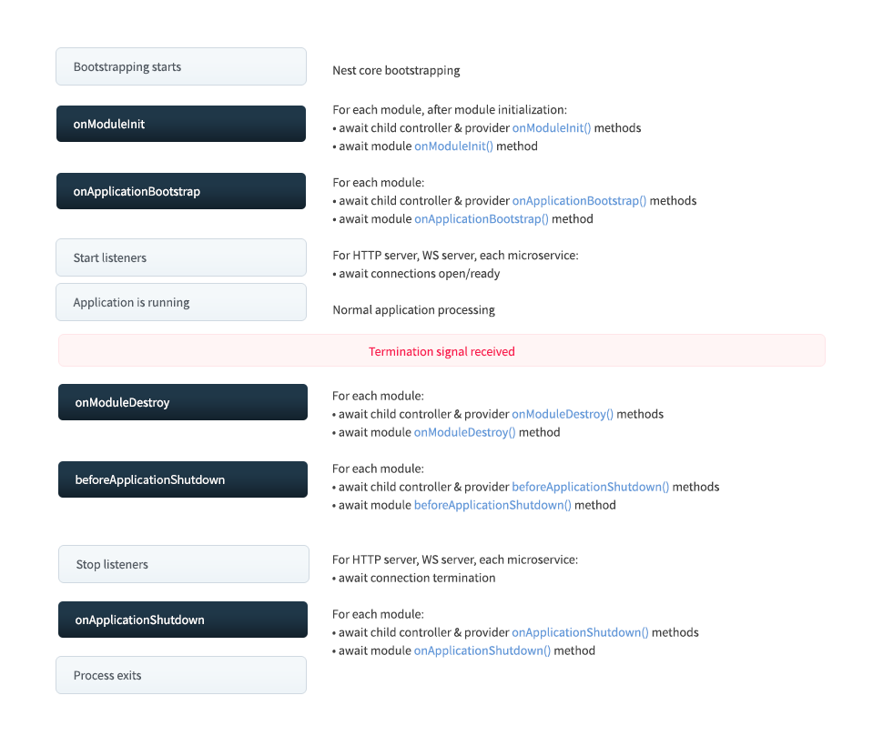

# 生命周期事件

Nest 应用程序以及每个应用程序元素都有一个由 Nest 管理的生命周期。
Nest 提供了 **生命周期钩子** ，可以看到关键的生命周期事件，并能够在事件发生时采取行动(在你的`模块`、`可注入`或`控制器`上运行注册的代码)。

## 生命周期序列

下图描述了关键应用程序生命周期事件的顺序，从应用程序启动到节点进程退出。

我们可以将整个生命周期分为三个阶段: **初始化** 、 **运行** 和 **终止**。

使用此生命周期，您可以计划适当的模块和服务初始化，管理活动连接，并在应用程序接收到终止信号时优雅地关闭应用程序。



## 生命周期事件

生命周期事件发生在应用程序引导和关闭期间。
Nest 在以下每个生命周期事件中调用`模块`、`注入器`和`控制器`上注册的生命周期钩子方法(**关机钩子** 需要首先启用，如下所述[下面](https://docs.nestjs.com/fundamentals/lifecycle-events#application-shutdown)).
如上图所示，Nest 还调用适当的底层方法来开始监听连接，并停止监听连接。

在下表中，`onModuleDestroy`， `beforeApplicationShutdown`和`onApplicationShutdown`只有当你显式调用`app.close()`或当进程接收到一个特殊的系统信号(如 SIGTERM)并且你在应用程序引导时正确调用`enableShutdownHooks`时才会触发(见下面的**应用程序关闭**部分)。

| 生命周期钩法                    | 生命周期事件触发钩方法调用                                                                                                        |
| ------------------------------- | --------------------------------------------------------------------------------------------------------------------------------- |
| `onModuleInit()`                | 在解析主机模块的依赖项后调用。                                                                                                    |
| `onApplicationBootstrap()`      | 在所有模块初始化后调用，但在监听连接之前。                                                                                        |
| `onModuleDestroy()`\*           | 在接收到终止信号(例如，`SIGTERM`)后调用。                                                                                         |
| `beforeApplicationShutdown()`\* | 在所有`onModuleDestroy()`处理程序完成(承诺解决或拒绝)后调用;一旦完成(承诺解决或拒绝)，所有现有的连接将被关闭(`app.close()`调用)。 |
| `onApplicationShutdown()`\*     | 在连接关闭后调用(`app.close()`解析)。                                                                                             |

\* 对于这些事件，如果你没有显式地调用`app.close()`，你必须选择加入以使它们与`SIGTERM`等系统信号一起工作。参见下面的[应用程序关闭](fundamentals/lifecycle-events#application-shutdown)。

!!! warning "**Warning**"

    上面列出的生命周期钩子没有针对 **请求划分的** 类触发。
    请求分类的类与应用程序生命周期无关，其寿命是无法预测的。
    它们是专门为每个请求创建的，并在发送响应后自动收集垃圾。

## 用法

每个生命周钩由接口表示。
接口在技术上是可选的，因为它们在 TypeScript 汇编后不存在。
尽管如此，最好使用它们来从强大的打字和编辑器工具中受益。
要注册生命周期钩，请实现适当的接口。
例如，要注册一个方法，在特定类(例如，Controller, Provider 或 Module)的模块初始化期间调用，通过提供一个`OnModuleInit()`方法来实现`OnModuleInit`接口，如下所示:

=== "TypeScript"

    ```typescript
    import { Injectable, OnModuleInit } from '@nestjs/common';

    @Injectable()
    export class UsersService implements OnModuleInit {
      onModuleInit() {
        console.log(`The module has been initialized.`);
      }
    }
    ```

=== "JavaScript"

    ```js
    import { Injectable } from '@nestjs/common';

    @Injectable()
    export class UsersService {
      onModuleInit() {
        console.log(`The module has been initialized.`);
      }
    }
    ```

## 异步初始化

`OnModuleInit`和`OnApplicationBootstrap`钩子都允许你推迟应用程序的初始化过程(返回一个`Promise`或将方法标记为`async`并在方法体中`await`一个异步方法完成)。

=== "TypeScript"

    ```typescript
    async onModuleInit(): Promise<void> {
      await this.fetch();
    }
    ```

=== "JavaScript"

    ```js
    async onModuleInit() {
      await this.fetch();
    }
    ```

## 应用程序关闭

`onModuleDestroy()`， `beforeApplicationShutdown()`和`onApplicationShutdown()`钩子在终止阶段被调用(响应对`app.close()`的显式调用或接收到系统信号，如 SIGTERM(如果选择了))。
此特性通常与[Kubernetes](https://kubernetes.io/)一起使用，以管理容器的生命周期，由[Heroku](https://www.heroku.com/)用于 dynos 或类似的服务。

关闭钩子监听器会消耗系统资源，所以默认情况下是禁用的。
要使用 shutdown 钩子，你必须通过调用`enableShutdownHooks()`来 **启用监听器**:

```typescript hl_lines="8"
import { NestFactory } from '@nestjs/core';
import { AppModule } from './app.module';

async function bootstrap() {
  const app = await NestFactory.create(AppModule);

  // Starts listening for shutdown hooks
  app.enableShutdownHooks();

  await app.listen(3000);
}
bootstrap();
```

!!! warning "**warning** "

    由于固有的平台限制，NestJS在Windows上对应用程序关闭钩子的支持有限。
    你可以期待`SIGINT`工作，以及`SIGBREAK`和某种程度上`SIGHUP` -[阅读更多](https://nodejs.org/api/process.html#process_signal_events)。
    然而，“SIGTERM”将永远不会在Windows上工作，因为在任务管理器中杀死进程是无条件的，“也就是说，应用程序没有办法检测或阻止它”。
    这里有一些来自libuv的[相关文档](https://docs.libuv.org/en/v1.x/signal.html)，了解更多关于`SIGINT`， `SIGBREAK`和其他在Windows上是如何处理的。
    另外，请参阅Node.js文档[Process Signal Events](https://nodejs.org/api/process.html#process_signal_events)

!!! info

    `enableShutdownHooks`通过启动侦听器消耗内存。
    如果你在一个Node进程中运行多个Nest应用程序(例如，当用Jest并行测试时)，Node可能会抱怨过多的侦听器进程。
    因此，`enableShutdownHooks`在默认情况下不启用。
    当您在单个Node进程中运行多个实例时，请注意这种情况。

当应用程序接收到终止信号时，它将调用任何已注册的`onModuleDestroy()`， `beforeApplicationShutdown()`，然后`onApplicationShutdown()`方法(在上述序列中)，相应的信号作为第一个参数。
如果一个已注册的函数正在等待异步调用(返回一个 promise)， Nest 将不会继续该序列，直到 promise 被解析或拒绝。

=== "TypeScript"

    ```typescript  hl_lines="3 4 5"
    @Injectable()
    class UsersService implements OnApplicationShutdown {
      onApplicationShutdown(signal: string) {
        console.log(signal); // e.g. "SIGINT"
      }
    }
    ```

=== "JavaScript"

    ```js
    @Injectable()
    class UsersService implements OnApplicationShutdown {
      onApplicationShutdown(signal) {
        console.log(signal); // e.g. "SIGINT"
      }
    }
    ```

!!! info "**Info**"

    调用`app.close()`不会终止Node进程，只会触发`onModuleDestroy()`和`onApplicationShutdown()`钩子，所以如果有一些间隔，长时间运行的后台任务等，进程不会自动终止。
