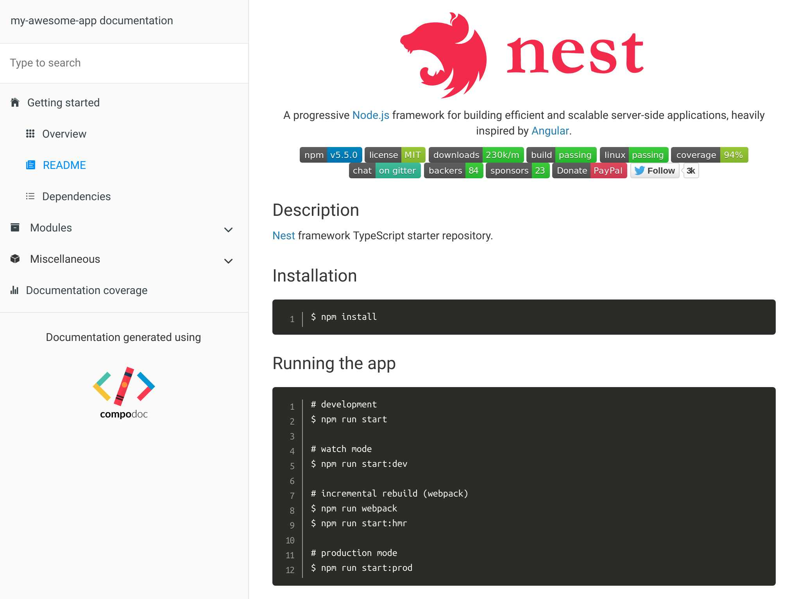
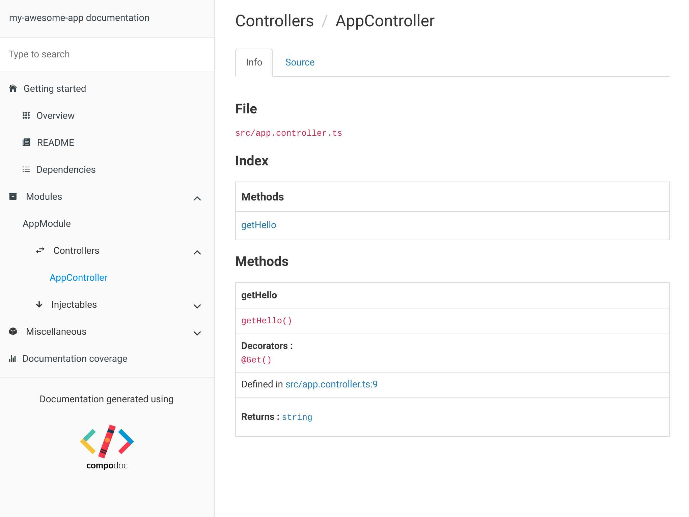

# 文档

**Compodoc** 是一个 Angular 应用的文档工具。
由于 Nest 和 Angular 共享相似的项目和代码结构， **Compodoc** 也适用于 Nest 应用程序。

## 设置

在现有的 Nest 项目中设置 Compodoc 非常简单。
首先在你的操作系统终端中使用以下命令添加 dev-dependency:

```bash
$ npm i -D @compodoc/compodoc
```

## 生成

使用下面的命令生成项目文档(为了支持 npx，需要 npm 6)。
请参阅[官方文档](https://compodoc.app/guides/usage.html)以获得更多选项。

```bash
$ npx @compodoc/compodoc -p tsconfig.json -s
```

打开浏览器并导航到[http://localhost:8080](http://localhost:8080)。
你应该看到一个初始的 Nest CLI 项目:




## 贡献

您可以参与 Compodoc 项目[此处](https://github.com/compodoc/compodoc)并为其做出贡献。
